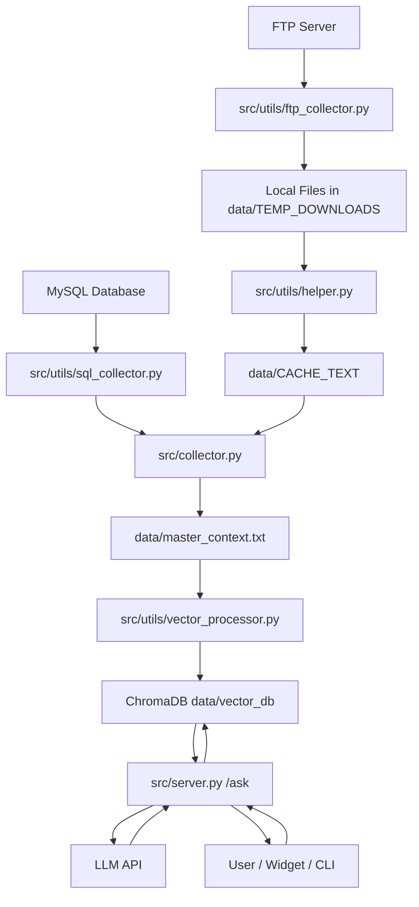

# HUPEDCARE Chatbot

HUPEDCARE Chatbot is a Retrieval-Augmented Generation (RAG) system that powers a digital assistant for the HUPEDCARE ecosystem.
It includes:

- a data ingestion pipeline that consolidates heterogeneous sources,
- a vector indexing workflow backed by ChromaDB,
- a FastAPI service that answers user questions through retrieval + generation,
- and an embeddable web widget for host websites.

Project websites:

- https://hupedcare.com
- https://project.hupedcare.com

## What This Repository Contains

- [src/collector.py](src/collector.py): ingestion orchestrator (FTP/files + SQL + context assembly).
- [src/server.py](src/server.py): FastAPI app exposing the chatbot API.
- [src/client.py](src/client.py): terminal client for manual testing.
- [src/utils](src/utils): shared utility modules (logging, extraction, SQL/FTP helpers, vector processing).
- [web/plugin.js](web/plugin.js): multilingual floating chatbot widget.
- [web/plugin.css](web/plugin.css): widget styling.
- [web/index.html](web/index.html): simple widget test page.
- [config/config.yaml](config/config.yaml): runtime configuration.

## End-to-End Runtime Flow

1. Source content is collected (FTP/local files + SQL query outputs).
2. Content is normalized into plain text and merged into [data/master_context.txt](data/master_context.txt).
3. The collector computes a hash of the assembled context.
4. If the hash changed, [src/utils/vector_processor.py](src/utils/vector_processor.py) rebuilds the ChromaDB collection under [data/vector_db](data/vector_db).
5. [src/server.py](src/server.py) retrieves top-k relevant chunks and sends them to the configured chat model.
6. Clients consume the API through POST /ask.

## Requirements

- Python 3 (recommended: modern 3.x runtime)
- Network access to configured providers/services:
	- model provider API,
	- FTP server,
	- MySQL server.

Install Python dependencies:

```bash
pip install -r requirements.txt
```

## Configuration

### 1) Environment variables

Create a local .env file from [.env.structure](.env.structure) and provide at least:

- MODEL_API_KEY
- FTP_HOST
- FTP_USER
- FTP_PASSWORD
- FTP_REMOTE_PATH
- DB_HOST
- DB_USER
- DB_PASSWORD
- DB_NAME

### 2) Application configuration

Main runtime settings live in [config/config.yaml](config/config.yaml):

- ai: chat model, vision/transcription models, system prompt, provider base URL.
- embeddings: embedding model, top_k, chunking, temperature.
- server: host/port, public_urls (multi-URL), CORS allowlist/regex.
- storage: data folder root.
- database: SQL queries injected into the RAG corpus.
- logger: rotation and verbosity settings.

## Frontend Endpoint Configuration

The widget endpoint is externalized from [web/plugin.js](web/plugin.js).

1. Copy [web/chatbot-config.structure.js](web/chatbot-config.structure.js) to web/chatbot-config.js.
2. Edit window.CHATBOT_CONFIG.apiUrls in web/chatbot-config.js.
3. Keep web/chatbot-config.js local (it is ignored by [.gitignore](.gitignore)).

Notes:

- [web/index.html](web/index.html) loads chatbot-config.js before plugin.js.
- Backend source-of-truth for public API bases is [config/config.yaml](config/config.yaml) server.public_urls.
- Keep both values aligned for each environment.

## Local Run

Run from repository root.

### 1) Build/update corpus and vectors

```bash
python src/collector.py
```

### 2) Start API server

```bash
python src/server.py
```

### 3) Optional terminal client

```bash
python src/client.py
```

### 4) Health checks

```bash
curl http://127.0.0.1:8000/health
curl http://127.0.0.1:8000/ready
curl http://127.0.0.1:8000/metrics
```

## API Endpoints

- POST /ask: retrieval-augmented answer generation.
- GET /health: liveness probe.
- GET /ready: readiness probe (API key, vector DB path, collection availability).
- GET /metrics: in-memory counters and latency aggregates.

## Deployment Checklist

1. Configure production values in [config/config.yaml](config/config.yaml).
2. Provide all required secrets as environment variables.
3. Run one ingestion cycle before serving traffic.
4. Start the API process with supervision/restart policy.
5. Ensure persistent storage for data and logs.
6. Restrict CORS origins to trusted domains only.
7. Configure frontend endpoint via web/chatbot-config.js for the target environment.

## Operational Notes

- Ingestion is idempotent: vector rebuild runs only when master_context hash changes.
- The API retrieves context dynamically to tolerate collection refresh windows.
- Logging is centralized and supports rotation (see logger section in [config/config.yaml](config/config.yaml)).

## Troubleshooting

- 401/403 from model provider:
	- Verify MODEL_API_KEY and ai.base_url.
- Widget cannot connect:
	- Check web/chatbot-config.js apiUrl and server CORS settings in [config/config.yaml](config/config.yaml).
- Empty or weak answers:
	- Run collector again and confirm [data/master_context.txt](data/master_context.txt) and [data/vector_db](data/vector_db) were updated.
- Readiness fails:
	- Check /ready response details, then validate vector DB path and rag_context collection state.

## Useful Scripts

Helper scripts are available in [scripts](scripts):

- setup: [scripts/setup.sh](scripts/setup.sh), [scripts/setup.bat](scripts/setup.bat)
- supervision: [scripts/supervisor.sh](scripts/supervisor.sh), [scripts/supervisor.bat](scripts/supervisor.bat)
- requirements refresh: [scripts/update_reqs.sh](scripts/update_reqs.sh), [scripts/update_reqs.bat](scripts/update_reqs.bat)
- mermaid export: [scripts/export_mermaid.sh](scripts/export_mermaid.sh), [scripts/export_mermaid.bat](scripts/export_mermaid.bat)

## Architecture Diagram



## License

Licensed under the [MIT License](LICENSE).