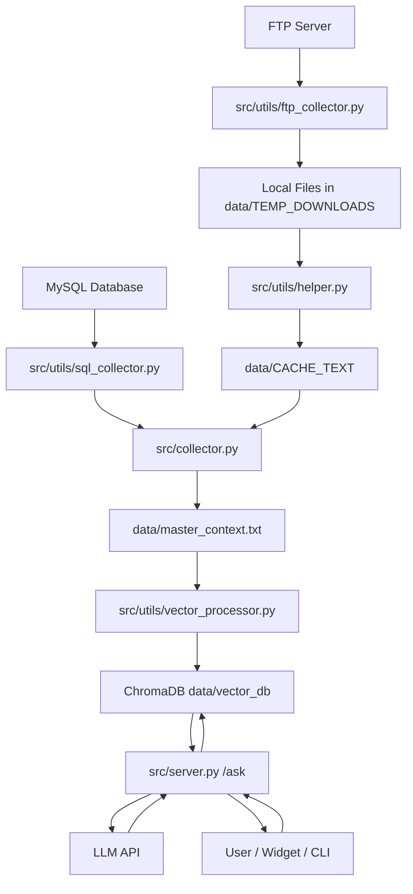

# HUPEDCARE Chatbot

This repository contains the current backend, ingestion pipeline, and web widget for the HUPEDCARE chatbot. The project follows a Retrieval-Augmented Generation (RAG) architecture: source content is collected and normalized into a master context, embedded into a vector database, and then queried by a FastAPI service that answers end-user questions.

## About HUPEDCARE

This software is part of the HUPEDCARE initiative and is intended to support its digital assistant and knowledge services.

- Main website: https://hupedcare.com
- Project platform: https://project.hupedcare.com

## Architecture

The system is split into four runtime areas:

- Data ingestion: [src/collector.py](src/collector.py) orchestrates file processing, SQL export, master context generation, and vector database refresh.
- API server: [src/server.py](src/server.py) serves the `/ask` endpoint and combines retrieved context with the system prompt before calling the chat model.
- Shared utilities: [src/utils](src/utils) contains extractors, logging setup, SQL and FTP collectors, and vector indexing helpers.
- Frontend widget: [web/plugin.js](web/plugin.js) injects the floating chat UI into any host page and sends user questions to the backend.

## Runtime Flow

1. Raw source files are mirrored into `data/TEMP_DOWNLOADS`.
2. Extractors convert each supported file into plain text stored in `data/CACHE_TEXT`.
3. SQL queries defined in [config/config.yaml](config/config.yaml) are executed and normalized into text blocks.
4. The collector merges SQL output and cached file content into `data/master_context.txt`.
5. When `master_context.txt` changes, [src/utils/vector_processor.py](src/utils/vector_processor.py) rebuilds the `rag_context` ChromaDB collection under `data/vector_db`.
6. The API server retrieves the most relevant chunks for each question and sends them to the configured language model.

## Source Map

### Core entry points

- [src/collector.py](src/collector.py): batch ingestion pipeline.
- [src/server.py](src/server.py): FastAPI application and retrieval/generation logic.
- [src/client.py](src/client.py): interactive command-line client for manual testing.

### Utility modules

- [src/utils/helper.py](src/utils/helper.py): config loading, metadata persistence, and text extraction helpers for HTML, PDF, image, audio, DOCX, and DOC files.
- [src/utils/ftp_collector.py](src/utils/ftp_collector.py): FTP synchronization with timestamp-based incremental download logic.
- [src/utils/sql_collector.py](src/utils/sql_collector.py): SQL extraction and normalization for WordPress-oriented records.
- [src/utils/vector_processor.py](src/utils/vector_processor.py): chunking and ChromaDB indexing.
- [src/utils/logger.py](src/utils/logger.py): shared rotating file and console logger setup.

### Frontend files

- [web/index.html](web/index.html): simple test page for the widget.
- [web/plugin.js](web/plugin.js): embeddable multilingual chat widget.
- [web/plugin.css](web/plugin.css): widget styling.

## Repository Structure

```text
.
├── config/
│   └── config.yaml
├── data/
│   ├── CACHE_TEXT/
│   ├── TEMP_DOWNLOADS/
│   ├── master_context.txt
│   └── vector_db/
├── docs/
│   ├── main.tex
│   ├── references.bib
│   └── images/
├── logs/
├── scripts/
│   ├── setup.bat
│   ├── setup.sh
│   ├── supervisor.bat
│   ├── supervisor.sh
│   ├── update_reqs.bat
│   └── update_reqs.sh
├── src/
│   ├── client.py
│   ├── collector.py
│   ├── server.py
│   └── utils/
│       ├── ftp_collector.py
│       ├── helper.py
│       ├── logger.py
│       ├── sql_collector.py
│       └── vector_processor.py
├── web/
│   ├── index.html
│   ├── plugin.css
│   └── plugin.js
├── README.md
├── requirements.txt
└── TODO.txt
```

## Configuration

Main configuration lives in [config/config.yaml](config/config.yaml). The most important sections are:

- `ai`: model names, base URL, system prompt, vision model, and transcription model.
- `embeddings`: embedding model, retrieval depth, chunk size, overlap, and temperature.
- `server`: public URL, allowed origins, and bind information.
- `database`: SQL queries used to enrich the knowledge base.
- `logger`: file and console logging behavior.
- `storage`: logical data folder used by the pipeline.

The runtime also expects environment variables for model access and external systems such as FTP and MySQL.

## Running the Project

### Install dependencies

```bash
pip install -r requirements.txt
```

### Start the ingestion pipeline

```bash
python src/collector.py
```

### Start the API server

```bash
python src/server.py
```

### Run the CLI client

```bash
python src/client.py
```

### Use helper scripts

The `scripts/` directory contains Windows and shell helpers for setup, supervision, and dependency refresh.

## Deployment Guide

### Required environment variables

Create a `.env` file (or equivalent secrets configuration in your deployment platform) and define at least the following variables:

- `MODEL_API_KEY`: API key for the language and embedding provider.
- `FTP_HOST`: FTP server hostname.
- `FTP_USER`: FTP username.
- `FTP_PASSWORD`: FTP password.
- `FTP_REMOTE_PATH`: Remote base directory for mirrored files (default is `/`).
- `DB_HOST`: MySQL host.
- `DB_USER`: MySQL user.
- `DB_PASSWORD`: MySQL password.
- `DB_NAME`: MySQL database name.

Optional variables can be introduced according to your provider requirements, but the keys above cover the current ingestion and serving flow.

### Production startup sequence

1. Configure [config/config.yaml](config/config.yaml) with production values for `server`, `database`, `embeddings`, and `logger`.
2. Ensure `storage.data_folder` points to a persistent path mounted in your runtime.
3. Run one ingestion cycle before exposing the API:
	- `python src/collector.py`
4. Start the API service:
	- `python src/server.py`
5. Point the frontend widget URL in [web/plugin.js](web/plugin.js) to your public backend endpoint.

### Recommended production practices

- Run `src/collector.py` on a schedule (for example with cron, Task Scheduler, or your process supervisor) rather than continuously.
- Keep `data/` and `logs/` on persistent storage.
- Restrict CORS in `config.yaml` to trusted origins only.
- Enable process supervision and automatic restarts for the API process.
- Rotate and retain logs according to your compliance needs.

## Architecture Diagram



## Supported Inputs

The ingestion pipeline currently handles:

- HTML and PHP pages
- Plain text files
- PDF documents
- DOCX documents
- Legacy DOC documents
- Images through the configured vision model
- Audio files through the configured transcription model
- SQL records returned by configured database queries

## Notes

- The collector uses cache files and a stored master-context hash to avoid unnecessary embedding rebuilds.
- ChromaDB storage is recreated when the assembled context changes.
- The web widget expects the backend `/ask` endpoint to be reachable from the host page.

## License

This project is licensed under the [MIT License](LICENSE).