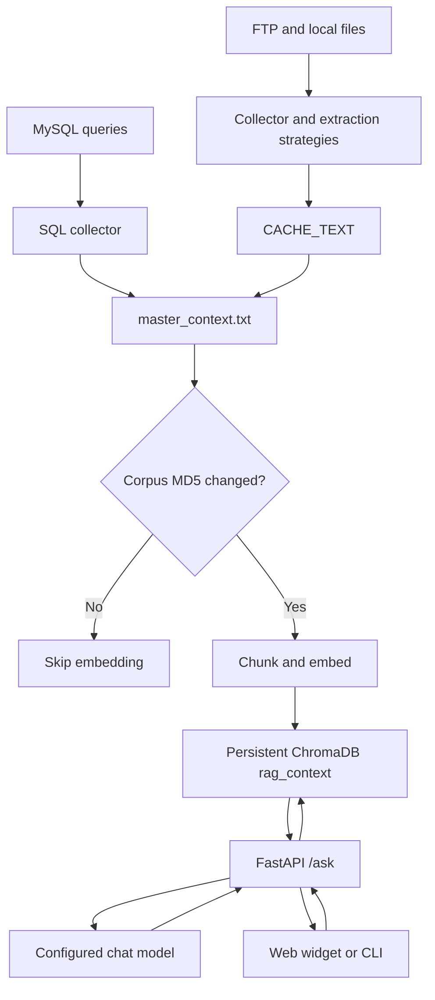

# HUPEDCARE Assistant

HUPEDCARE Assistant is a cost-aware, provenance-aware Retrieval-Augmented Generation (RAG) service for pediatric pain education. It turns heterogeneous institutional material into searchable text, stores embeddings in ChromaDB, and exposes a FastAPI endpoint for retrieval-grounded answers.

The project is designed for educational and decision-support workflows. It is not a diagnostic system, a certified medical device, or a substitute for professional clinical assessment.

Project websites:

- https://hupedcare.com
- https://project.hupedcare.com

## Capabilities

- FTP/local file synchronization with an idempotent extraction cache.
- SQL ingestion for configured MySQL queries.
- Text abstraction for PDF, DOCX, legacy DOC, HTML/PHP, images, audio, and TXT files.
- Image descriptions through a vision-capable model and audio transcription through Whisper.
- Filename-level provenance headers in the assembled corpus.
- MD5 hash gating to skip embedding when `master_context.txt` is unchanged.
- Full ChromaDB rebuild when the corpus changes, using configurable chunking.
- FastAPI inference service with CORS, health probes, readiness checks, and in-memory metrics.
- Embeddable browser widget and a terminal client.

Multimodal support applies to ingestion: images and audio are converted to text before indexing. Retrieval and generation operate over the resulting text corpus rather than directly over original image or audio content.

## Repository Layout

- [src/collector.py](src/collector.py): end-to-end FTP, file, SQL, corpus, and vector-update orchestrator.
- [src/server.py](src/server.py): FastAPI application exposing `/ask`, `/health`, `/ready`, and `/metrics`.
- [src/client.py](src/client.py): interactive terminal client.
- [src/core/extraction_strategies.py](src/core/extraction_strategies.py): extension-based modality strategy registry.
- [src/utils/vector_processor.py](src/utils/vector_processor.py): chunking, embedding, and ChromaDB rebuild logic.
- [src/utils/ftp_collector.py](src/utils/ftp_collector.py): FTP synchronization and metadata state.
- [src/utils/sql_collector.py](src/utils/sql_collector.py): configured SQL extraction.
- [config/config.yaml](config/config.yaml): models, retrieval, server, storage, database, and logging configuration.
- [web/plugin.js](web/plugin.js): browser chatbot widget.
- [web/chatbot-config.structure.js](web/chatbot-config.structure.js): frontend endpoint configuration template.
- [scripts/test_h1_idempotency.py](scripts/test_h1_idempotency.py): controlled ingestion idempotency test.
- [scripts/test_h2_cost_simulation.py](scripts/test_h2_cost_simulation.py): deterministic hash-gated cost simulation.
- [scripts/test_h3_ragas.py](scripts/test_h3_ragas.py): LLM-as-judge faithfulness and citation experiment.

Runtime data, logs, `.env` files, frontend runtime configuration, and LaTeX build output are ignored by Git. The checked-in `data/` tree may therefore differ between deployments.

## Architecture



The collector also uses a process lock and a configurable minimum interval to prevent overlapping or excessively frequent scheduled runs. File extraction is guarded by modification time; orphaned cache entries are removed when their source files disappear.

## Requirements

- Python 3.10 or newer is recommended.
- A model provider compatible with the configured OpenAI client.
- FTP access if remote file synchronization is enabled.
- MySQL access if SQL ingestion is enabled.
- Network access to the configured model provider for embeddings, generation, image descriptions, or transcription.

Install the pinned dependencies:

```bash
python -m venv .venv
source .venv/bin/activate       # Windows: .venv\Scripts\activate
python -m pip install -r requirements.txt
```

## Configuration

### Environment

Copy the template and fill in the values required by the enabled collectors and model provider:

```bash
cp .env.structure .env
```

At minimum, configure:

- `MODEL_API_KEY`
- `FTP_HOST`, `FTP_USER`, `FTP_PASSWORD`, and `FTP_REMOTE_PATH`
- `DB_HOST`, `DB_USER`, `DB_PASSWORD`, and `DB_NAME`

Do not commit `.env` or provider credentials. The application loads environment variables through `python-dotenv`.

### YAML configuration

Edit [config/config.yaml](config/config.yaml) for:

- `ai`: provider `base_url`, chat model, transcription model, vision model, and retrieval-first system prompt.
- `embeddings`: embedding model, `top_k`, temperature, chunk size, and overlap.
- `server`: bind host, bind port, public API URLs, and CORS origins.
- `storage`: runtime data directory.
- `database`: SQL queries added to the RAG corpus.
- `logger`: console level, file level, and rotation policy.

The current default server binds to `127.0.0.1:8081`. The vector collection is named `rag_context` under `<storage.data_folder>/vector_db`.

### Browser widget

Create the ignored runtime configuration from the template:

```bash
cp web/chatbot-config.structure.js web/chatbot-config.js
```

Set `window.CHATBOT_CONFIG.apiUrls` to the API base URL without `/ask`. Keep it aligned with `server.public_urls` and the CORS allowlist in [config/config.yaml](config/config.yaml). The test page is [web/index.html](web/index.html).

## Running Locally

Run all commands from the repository root.

### Build the corpus and index

```bash
python src/collector.py
```

The first run synchronizes configured sources, extracts changed files, writes `data/master_context.txt`, and creates or rebuilds the `rag_context` collection. Later runs skip unchanged file extraction and skip embeddings when the corpus hash is unchanged.

The collector may return without work when another instance holds `data/.collector.lock` or when the configured minimum interval has not elapsed. Set `COLLECTOR_MIN_INTERVAL_SECONDS` to override the configured interval for a controlled run.

### Start the API

```bash
python src/server.py
```

The default local base URL is `http://127.0.0.1:8081`.

### Test the API

```bash
curl http://127.0.0.1:8081/health
curl http://127.0.0.1:8081/ready
curl http://127.0.0.1:8081/metrics
curl -X POST http://127.0.0.1:8081/ask \
  -H 'Content-Type: application/json' \
  -d '{"question":"What is the FLACC pain scale?"}'
```

The `/ask` response has the form `{"response":"...","status":"success"}`. If the collection is being rebuilt, it returns a temporary `status` of `updating` so the client can retry.

### Terminal client

```bash
python src/client.py
```

## Validation Scripts

The focused scripts reproduce the architectural checks described in the project paper:

```bash
python scripts/test_h1_idempotency.py
python scripts/test_h2_cost_simulation.py
```

H1 uses synthetic files and checks zero re-extraction on an unchanged pass, selective re-extraction after modification, and orphan-cache cleanup. H2 is deterministic and makes no real embedding API calls; it compares full reindexing with hash-gated reindexing over a configurable cycle schedule.

H3 runs the RAG pipeline against 20 questions by default and requires a configured API key, an indexed corpus, and model-provider calls:

```bash
python scripts/test_h3_ragas.py
python scripts/test_h3_ragas.py --top-k 6 --questions 15
```

It compares provenance-enabled and provenance-stripped collections using LLM-as-judge faithfulness and a regular-expression audit for explicit source citations. Citation presence is not citation correctness, and the experiment is not a clinical safety evaluation.

## API Reference

| Method | Path | Purpose |
| --- | --- | --- |
| `POST` | `/ask` | Retrieve context and generate an answer. JSON body: `{"question": "..."}`. |
| `GET` | `/health` | Lightweight liveness response and configured public URLs. |
| `GET` | `/ready` | Checks API-key presence, vector path, and `rag_context` availability. Returns HTTP 503 when not ready. |
| `GET` | `/metrics` | In-memory request counters and `/ask` latency aggregates. |

## Operational and Safety Notes

- The system prompt requests answers only from retrieved context and asks the model to mention a source. This is a probabilistic policy, not deterministic verification.
- The current provenance format is filename-level. It does not provide immutable document IDs, version manifests, extraction metadata, or citation entailment checks.
- A changed corpus triggers a full vector-collection rebuild; document- and chunk-level incremental indexing is not implemented.
- FTP change detection currently relies on modification times and does not atomically publish checksum-verified downloads.
- The API has no deterministic domain classifier, dosage/emergency hard stop, minimum similarity threshold, patient-context validation, or programmatic source-support check.
- Do not use this prototype to resolve urgent, diagnostic, dosing, contraindication, or treatment-escalation questions. Those require direct assessment by a qualified clinician.
- Configure trusted CORS origins, protect secrets, persist data and logs, and place the API behind an appropriate reverse proxy and process supervisor for deployment.

## Deployment Helpers

- Setup: [scripts/setup.sh](scripts/setup.sh) and [scripts/setup.bat](scripts/setup.bat).
- Process supervision: [scripts/supervisor.sh](scripts/supervisor.sh) and [scripts/supervisor.bat](scripts/supervisor.bat).
- Dependency refresh: [scripts/update_reqs.sh](scripts/update_reqs.sh) and [scripts/update_reqs.bat](scripts/update_reqs.bat).
- Mermaid export: [scripts/export_mermaid.sh](scripts/export_mermaid.sh) and [scripts/export_mermaid.bat](scripts/export_mermaid.bat).

## License

Licensed under the [MIT License](LICENSE).